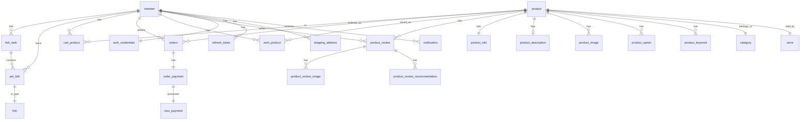

## DB 테이블 관계

```mermaid
erDiagram
    member ||--o{ fish_tank: has
    member ||--o{ pet_fish: owns
    member ||--o{ cart_product: has
    member ||--o{ orders: places
    member ||--o{ wish_product: has
    member ||--o{ product_review: writes
    member ||--|| auth_credentials: has
    member ||--o{ refresh_token: has
    member ||--o{ shipping_address: has
    member ||--o{ notification: receives
    fish_tank ||--o{ pet_fish: contains
    pet_fish ||--|| fish: is_type
    product ||--o{ cart_product: in
    product ||--o{ orders: ordered_as
    product ||--o{ wish_product: saved_as
    product ||--o{ product_review: has
    product ||--|| product_info: has
    product ||--o| product_description: has
    product ||--o{ product_image: has
    product ||--o{ product_option: has
    product ||--o{ product_keyword: has
    product ||--|| category: belongs_to
    product ||--|| store: sold_by
    orders ||--|| order_payment: has
    order_payment ||--|| toss_payment: processes
    product_review ||--o{ product_review_image: has
    product_review ||--o{ product_review_recommendation: has
```

## DB ERD

```mermaid
erDiagram
%% Member Related Tables
    member {
        bigint id PK
        bigint auth_credentials_id FK
        varchar nickname
        varchar authority
        varchar profile_image_url
        boolean is_deleted
        integer fish_tank_count
        integer fish_life_year
        boolean has_agreed_to_marketing_notification
    }

    auth_credentials {
        bigint id PK
        bigint oauth_id
        varchar oauth_access_token
        varchar oauth_refresh_token
        timestamp oauth_access_token_expires_at
        integer oauth_server_number
        boolean is_deleted
        timestamp created_at
        timestamp updated_at
    }

    refresh_token {
        bigint id PK
        bigint member_id FK
        varchar token
        timestamp created_at
        timestamp updated_at
    }

    shipping_address {
        bigint id PK
        bigint member_id FK
        varchar name
        varchar receiver
        varchar phone_number
        integer zip_code
        varchar address
        varchar detail_address
        boolean is_default_address
        timestamp created_at
        timestamp updated_at
    }

    notification {
        bigint id PK
        bigint member_id FK
        varchar title
        varchar content
        boolean is_read
        timestamp created_at
        timestamp updated_at
    }

%% Fish Related Tables
    fish_tank {
        bigint id PK
        bigint member_id FK
        varchar name
        tinyint size
        date installation_date
    }

    pet_fish {
        bigint id PK
        bigint member_id FK
        bigint fish_tank_id FK
        bigint fish_id FK
        integer count
        varchar sex
    }

    fish {
        bigint id PK
        varchar species
    }

%% Product Related Tables
    product {
        bigint id PK
        bigint store_id FK
        bigint category_id FK
        bigint product_info_id FK
        bigint product_description_id FK
        varchar name
        varchar thumbnail_url
        numeric price
        numeric discount_price
        integer discount_rate
        numeric common_delivery_fee
        numeric safe_delivery_fee
        numeric pick_up_delivery_fee
        integer review_count
        integer review_total_score
        integer wish_count
        boolean is_deleted
        timestamp created_at
        timestamp updated_at
    }

    product_description {
        bigint id PK
        varchar title
        varchar content
        timestamp created_at
        timestamp updated_at
    }

    product_image {
        bigint id PK
        bigint product_id FK
        varchar image_url
        varchar image_type
        timestamp created_at
        timestamp updated_at
    }

    product_info {
        bigint id PK
        bigint category_id FK
        varchar difficulty_level
        varchar temperament
        varchar optimal_tank_size
        integer optimal_temperature_min
        integer optimal_temperature_max
        timestamp created_at
        timestamp updated_at
    }

    product_keyword {
        bigint id PK
        bigint product_id FK
        varchar word
    }

    product_option {
        bigint id PK
        bigint product_id FK
        varchar sex
        numeric additional_price
        timestamp created_at
        timestamp updated_at
    }

    product_recommendation {
        bigint id PK
        bigint product_id FK
        timestamp created_at
        timestamp updated_at
    }

    product_snapshot {
        bigint id PK
        bigint product_id FK
        bigint store_id FK
        bigint category_id FK
        bigint product_info_id FK
        bigint product_description_id FK
        varchar name
        varchar thumbnail_url
        numeric price
        numeric discount_price
        integer discount_rate
        numeric common_delivery_fee
        numeric safe_delivery_fee
        numeric pick_up_delivery_fee
        timestamp created_at
        timestamp updated_at
    }

%% Review Related Tables
    product_review {
        bigint id PK
        bigint member_id FK
        bigint product_id FK
        varchar content
        integer score
        integer recommend_count
        boolean has_photos
        timestamp created_at
        timestamp updated_at
    }

    product_review_image {
        bigint id PK
        bigint product_review_id FK
        varchar image_url
        timestamp created_at
        timestamp updated_at
    }

    product_review_recommendation {
        bigint id PK
        bigint member_id FK
        bigint product_review_id FK
        timestamp created_at
        timestamp updated_at
    }

%% Cart & Order Related Tables
    cart_product {
        bigint id PK
        bigint member_id FK
        bigint product_id FK
        integer quantity
        tinyint sex
        varchar delivery_method
        numeric delivery_fee
        timestamp created_at
        timestamp updated_at
    }

    orders {
        bigint id PK
        bigint member_id FK
        bigint product_id FK
        bigint store_id FK
        varchar order_number
        varchar order_name
        numeric order_price
        numeric original_price
        numeric discount_price
        integer discount_rate
        numeric delivery_fee
        numeric total_amount
        integer quantity
        tinyint delivery_method
        varchar sex
        varchar receiver
        varchar phone_number
        integer zip_code
        varchar address
        varchar detail_address
        varchar request_message
        varchar shipping_number
        varchar product_name
        varchar store_name
        varchar thumbnail_url
        timestamp created_at
        timestamp updated_at
    }

    order_payment {
        bigint id PK
        bigint order_id FK
        bigint toss_payment_id FK
        bigint prev_id FK
        varchar status
    }

    toss_payment {
        bigint id PK
        varchar payment_key
        varchar order_number
        varchar order_name
        numeric total_amount
        varchar type
        varchar method
        varchar status
        boolean use_escrow
        varchar requested_at
        varchar approved_at
    }

%% Other Tables
    category {
        bigint id PK
        varchar family
        varchar species
    }

    store {
        bigint id PK
        varchar name
        timestamp created_at
        timestamp updated_at
    }

    wish_product {
        bigint id PK
        bigint member_id FK
        bigint product_id FK
        timestamp created_at
        timestamp updated_at
    }

    announcement {
        bigint id PK
        varchar title
        varchar link_url
        timestamp created_at
        timestamp updated_at
    }

    banner {
        bigint id PK
        varchar image_url
        varchar link_url
        timestamp created_at
        timestamp updated_at
    }

    banned_word {
        bigint id PK
        varchar word
    }

    nickname_word {
        bigint id PK
        varchar word
    }

%% Relationships
    member ||--|| auth_credentials: has
    member ||--o{ refresh_token: has
    member ||--o{ notification: receives
    member ||--o{ shipping_address: has
    member ||--o{ fish_tank: owns
    member ||--o{ pet_fish: has
    member ||--o{ cart_product: has
    member ||--o{ orders: places
    member ||--o{ wish_product: has
    member ||--o{ product_review: writes
    member ||--o{ product_review_recommendation: makes
    fish_tank ||--o{ pet_fish: contains
    pet_fish ||--|| fish: is_type
    product ||--o{ cart_product: in
    product ||--o{ orders: ordered_as
    product ||--o{ wish_product: saved_as
    product ||--o{ product_review: has
    product ||--|| product_info: has
    product ||--o| product_description: has
    product ||--o{ product_image: has
    product ||--o{ product_option: has
    product ||--o{ product_keyword: has
    product ||--o{ product_recommendation: has
    product ||--|| category: belongs_to
    product ||--|| store: sold_by
    product ||--o{ product_snapshot: has
    orders ||--|| order_payment: has
    order_payment ||--|| toss_payment: processes
    product_review ||--o{ product_review_image: has
    product_review ||--o{ product_review_recommendation: has
```
